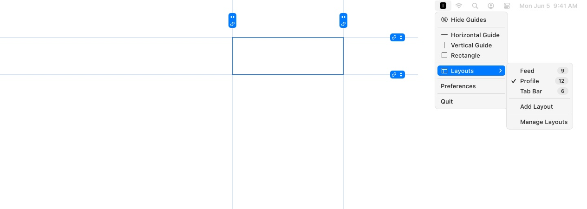

# ✨ Lyne

 

### ✨ New Features

#### 🎛 Gesture-based

Click and drag from the app icon in the menu bar to create a Guide, and swipe across the screen to delete.

#### ▭ Rectangle

Lyne's rectangle tool swiftly generates four Guides. Use keyboard arrows to add intermediary Guides and adjust intersections with ease.

#### 🔗 Link

Link Guides to establish consistent spacing and prevent design shifts, ensuring efficiency and precision throughout the design or coding process.

#### 🎯 Precision

Use the keyboard arrow for precise adjustment.

#### 🖥 Multiple Screens

Choose whether groups of Guides appear on all screens or just one. Tailor your workspace according to your needs.

#### 📐 Layouts

Lyne's layouts let you organize and display only the Guides you need. No need to delete them, just hide for later.

#### ⌨️ Shortcuts

Made for your keyboard. Create, edit, and organize your guides with quick shortcuts. Everything’s covered.

---

## 📦 Lyne 1.1

- **Release Date:** September 28, 2025
- **Compatibility:** macOS 26

### 🚀 What’s New

- **macOS 26 Ready** — fully optimized for the latest macOS release
- **Stability Improvements** — fixed minor issues for a smoother experience

### 📥 Download

